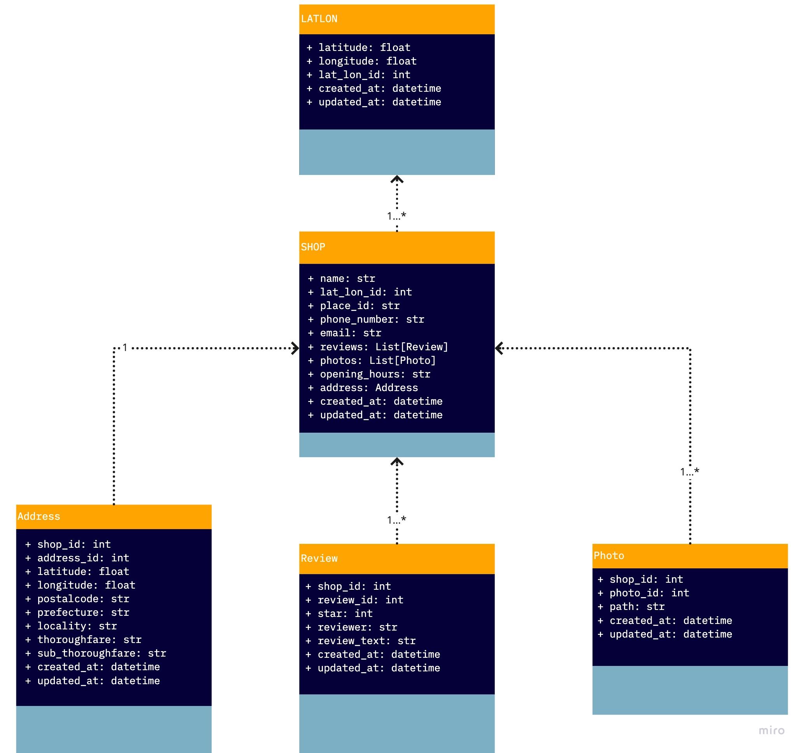

Chikamen-Backend-API
====


Chikamen-Backend-APIはiOSアプリケーション”ちかめん”の情報を取得するAPIです。
blog: https://zerebom.hatenablog.com/entry/2021/06/03/083433 

## Description
Google Place APIを利用して、近隣のラーメンのデータを取得します。
下記のように内部でデータを取得します。

1. `api/v1/shops/near` に緯度経度をパラメータを含めた状態でアクセスすると、DB内の過去にアクセスされた緯度経度をチェックします
2. 過去にアクセスされていた場合、DB内から近いデータを変えします
3. そうでない場合GCPにアクセスしてデータを取得し、保存した後にデータを返します。

ex)
```bash
#近隣のラーメンデータを20件取得する(MAX=20)
curl "http://54.168.84.114:3000/api/v1/shops/near?latitude=35.61&longitude=139.65" | jq .

#近隣のラーメンデータのidだけ取得する
curl "http://54.168.84.114:3000/api/v1/shops/near?latitude=35.61&longitude=139.65"| jq 'data[] .id'

```


### データベーススキーム


<details>

``` ruby
  create_table "addresses", force: :cascade do |t|
    t.integer "shop_id"
    t.float "latitude"
    t.float "longitude"
    t.string "postalcode"
    t.string "prefecture"
    t.string "county"
    t.string "locality"
    t.string "thoroughfare"
    t.string "sub_thoroughfare"
    t.datetime "created_at", null: false
    t.datetime "updated_at", null: false
  end

  create_table "lat_lons", force: :cascade do |t|
    t.float "latitude"
    t.float "longitude"
    t.datetime "created_at", null: false
    t.datetime "updated_at", null: false
  end

  create_table "photos", force: :cascade do |t|
    t.integer "shop_id"
    t.string "path"
    t.datetime "created_at", null: false
    t.datetime "updated_at", null: false
  end

  create_table "reviews", force: :cascade do |t|
    t.string "reviewer"
    t.integer "star"
    t.text "review_text"
    t.datetime "created_at", null: false
    t.datetime "updated_at", null: false
    t.integer "shop_id"
  end

  create_table "shops", force: :cascade do |t|
    t.string "name"
    t.string "phone_number"
    t.string "email"
    t.datetime "created_at", null: false
    t.datetime "updated_at", null: false
    t.string "place_id"
    t.string "opening_hours"
    t.integer "lat_lon_id"
  end

end

```

</details>

### 利用できるAPIエンドポイント
```
           Prefix Verb    URI Pattern                                                                              Controller#Action
        api_v1_shops_near GET    /api/v1/shops/near(.:format)                                                             api/v1/shops#sort_by_near
      api_v1_shop_reviews GET    /api/v1/shops/:shop_id/reviews(.:format)                                                 api/v1/reviews#index
                          POST   /api/v1/shops/:shop_id/reviews(.:format)                                                 api/v1/reviews#create
       api_v1_shop_review GET    /api/v1/shops/:shop_id/reviews/:id(.:format)                                             api/v1/reviews#show
                          PATCH  /api/v1/shops/:shop_id/reviews/:id(.:format)                                             api/v1/reviews#update
                          PUT    /api/v1/shops/:shop_id/reviews/:id(.:format)                                             api/v1/reviews#update
                          DELETE /api/v1/shops/:shop_id/reviews/:id(.:format)                                             api/v1/reviews#destroy
    api_v1_shop_addresses GET    /api/v1/shops/:shop_id/addresses(.:format)                                               api/v1/addresses#index
                          POST   /api/v1/shops/:shop_id/addresses(.:format)                                               api/v1/addresses#create
      api_v1_shop_address GET    /api/v1/shops/:shop_id/addresses/:id(.:format)                                           api/v1/addresses#show
                          PATCH  /api/v1/shops/:shop_id/addresses/:id(.:format)                                           api/v1/addresses#update
                          PUT    /api/v1/shops/:shop_id/addresses/:id(.:format)                                           api/v1/addresses#update
                          DELETE /api/v1/shops/:shop_id/addresses/:id(.:format)                                           api/v1/addresses#destroy
       api_v1_shop_photos GET    /api/v1/shops/:shop_id/photos(.:format)                                                  api/v1/photos#index
                          POST   /api/v1/shops/:shop_id/photos(.:format)                                                  api/v1/photos#create
        api_v1_shop_photo GET    /api/v1/shops/:shop_id/photos/:id(.:format)                                              api/v1/photos#show
                          PATCH  /api/v1/shops/:shop_id/photos/:id(.:format)                                              api/v1/photos#update
                          PUT    /api/v1/shops/:shop_id/photos/:id(.:format)                                              api/v1/photos#update
                          DELETE /api/v1/shops/:shop_id/photos/:id(.:format)                                              api/v1/photos#destroy
             api_v1_shops GET    /api/v1/shops(.:format)                                                                  api/v1/shops#index
                          POST   /api/v1/shops(.:format)                                                                  api/v1/shops#create
              api_v1_shop GET    /api/v1/shops/:id(.:format)                                                              api/v1/shops#show
                          PATCH  /api/v1/shops/:id(.:format)                                                              api/v1/shops#update
                          PUT    /api/v1/shops/:id(.:format)                                                              api/v1/shops#update
                          DELETE /api/v1/shops/:id(.:format)                                                              api/v1/shops#destroy
```


## Demo


## Usage

- 近隣のラーメンデータを20件取得する(MAX=20)
    - `curl "http://54.168.84.114:3000/api/v1/shops/near?latitude=35.61&longitude=139.65 | jq ."`

- 近隣のラーメンデータのidだけ取得する
    - `curl "http://54.168.84.114:3000/api/v1/shops/near?latitude=35.61&longitude=139.65"| jq 'data[] .id'`

- shop_id 620のレビューをすべて取得する
    - `curl "http://54.168.84.114:3000/api/v1/shops/620/reviews" |jq ."`


## Caution
Chikamen-backend-APIは現在開発中です。下記のようなバグが確認されています。

- 画像が取得できない


